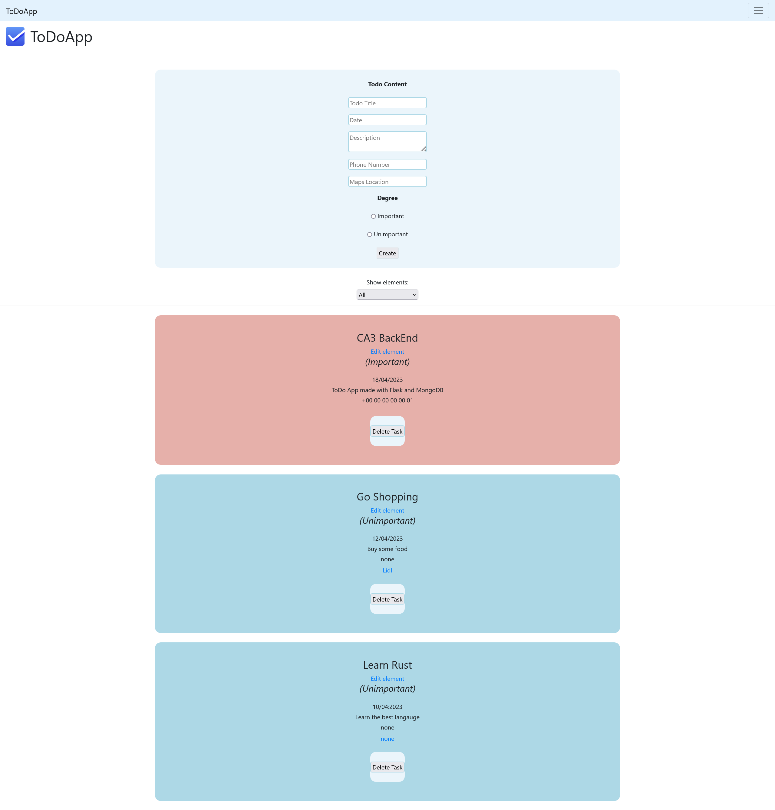

# ✅ ToDoApp
A very simple, clean and quick ToDoApp
___
This project is a MongoDB and Flask App for my CA4 Back-End Course.
Very simple, clean, quick to use it as a personal ToDo App !

The aim of this project is to do an App link to a MongoDB Database. 
This very simple app includes a login and register feature, to link with different accounts. 
Also added many key features really useful for a daily use. Enjoy !

---

---
# 🎉 Features

- ✅ **Create your account for free ! And access all you ToDos instantly !**
- ✅ **Online** with Atlas (MongoDB) ! (or selfhost)
- ✅ **Create, edit and delete** ToDos as you want !
- ✅ **Simple design and lightweight**, easy to load !
- ☑️ **Descriptions, dates, phone numbers, links** to make you more organised !
- ☑️ **Organise your tasks** with important/unimportant tasks filters !
- 🐈‍⬛ **Open Source !**

---
# 🧪 Tests
> ✅ **Tested**
> 
> ❌ **Not tested**

- ✅ Tested **views and access to pages** with a logged in/out user
- ✅ **Login and Register** users
- ✅ **Todos access, create-ability, edit-ability and filters**
- ❌ **Wrong user IDs** to log in 